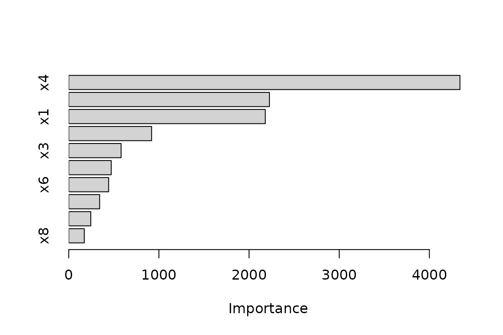
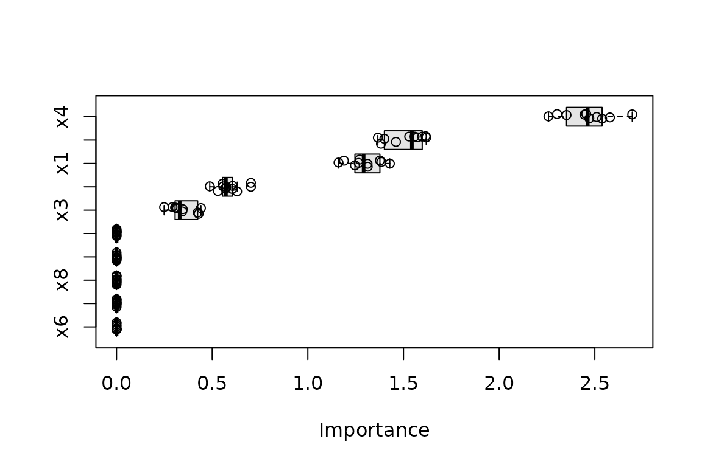
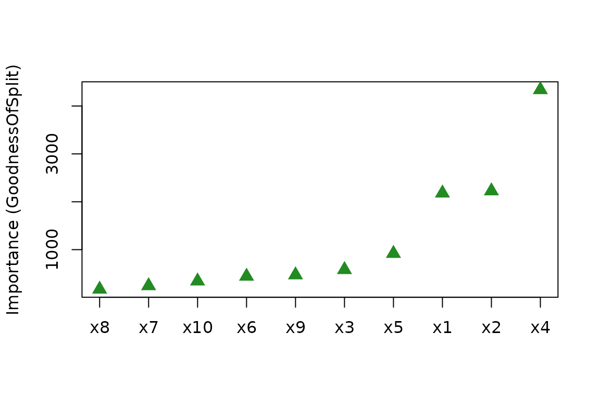

# Variable importance plots: an introduction to vip

Machine learning models are often summarized by a single accuracy metric
and then put into production. Understanding *which* features actually
drive a model’s predictions—variable importance (VI)—is a fundamental
part of interpretable machine learning. The **vip** package provides a
single, consistent interface for computing VI scores
([`vi()`](https://bgreenwell.github.io/vip/reference/vi.md)) and
plotting them
([`vip()`](https://bgreenwell.github.io/vip/reference/vip.md)) across
dozens of model types, using both *model-specific* and *model-agnostic*
approaches. This vignette is a condensed, up-to-date tour; for the full
methodology, please see (and cite) our article in *The R Journal*
([Greenwell and Boehmke 2020](#ref-RJ-2020-013)).

**vip** supports four methods, selected via the `method` argument to
[`vi()`](https://bgreenwell.github.io/vip/reference/vi.md):

- `method = "model"` (the default): model-specific VI scores, extracted
  from the fitted model itself (e.g., split-based importance in trees);
  see
  [`?vi_model`](https://bgreenwell.github.io/vip/reference/vi_model.md)
  for the full list of supported classes.
- `method = "permute"`: permutation importance ([Breiman
  2001](#ref-random-breiman-2001); [Fisher et al.
  2018](#ref-fisher-model-2018)), the drop in performance after
  shuffling each feature.
- `method = "firm"`: variance-based importance computed from feature
  effect plots ([Greenwell et al. 2018](#ref-greenwell-simple-2018)).
- `method = "shap"`: mean absolute Shapley values ([Štrumbelj and
  Kononenko 2014](#ref-strumbelj-2014-explaining)), computed via the
  [fastshap](https://cran.r-project.org/package=fastshap) package.

## Example data

Throughout we simulate data from the Friedman 1 benchmark problem
([Friedman 1991](#ref-multivariate-friedman-1991)): ten uniform
features, of which only `x1`–`x5` truly affect the response.

``` r

library(vip)
#> 
#> Attaching package: 'vip'
#> The following object is masked from 'package:utils':
#> 
#>     vi

trn <- gen_friedman(500, seed = 101)  # see ?vip::gen_friedman
head(trn)
#>          y         x1        x2        x3        x4         x5          x6
#> 1 14.47244 0.37219838 0.4055438 0.1016229 0.3224803 0.69258669 0.757968756
#> 2 14.94207 0.04382482 0.6022770 0.6022517 0.9986640 0.77643413 0.532993932
#> 3 14.11543 0.70968402 0.3619997 0.2536424 0.5484119 0.01797597 0.764821812
#> 4 10.17991 0.65769040 0.2912156 0.5419870 0.3274199 0.22965950 0.300911111
#> 5 17.86439 0.24985572 0.7937777 0.3834077 0.9474794 0.46236212 0.004866698
#> 6 18.19178 0.30005483 0.7013581 0.9919663 0.3864848 0.66623343 0.198093488
#>          x7        x8        x9       x10
#> 1 0.5178156 0.5303942 0.8778652 0.7627513
#> 2 0.5094878 0.4874874 0.1176985 0.1755692
#> 3 0.7150814 0.8444552 0.3343627 0.1183739
#> 4 0.1767543 0.3457895 0.4744478 0.2830193
#> 5 0.2695334 0.1141429 0.4886461 0.3106974
#> 6 0.9235006 0.7748745 0.7356329 0.9738575
```

## Model-specific importance

When a model class provides its own importance measure,
[`vi()`](https://bgreenwell.github.io/vip/reference/vi.md) extracts it
directly. For example, decision trees measure importance through the
goodness of split ([Breiman et al.
1984](#ref-classification-breiman-1984)):

``` r

library(rpart)

tree <- rpart(y ~ ., data = trn)
vi(tree)  # a data frame of class "vi"
#>    Variable Importance
#> 1        x4  4339.3731
#> 2        x2  2226.0447
#> 3        x1  2180.1566
#> 4        x5   919.1159
#> 5        x3   580.9045
#> 6        x9   471.2040
#> 7        x6   442.5479
#> 8       x10   342.8346
#> 9        x7   244.3592
#> 10       x8   172.1922
```

`"vi"` objects have a
[`plot()`](https://rdrr.io/r/graphics/plot.default.html) method (drawing
with lightweight base R graphics via the
[tinyplot](https://grantmcdermott.com/tinyplot/) package) that invisibly
returns the plotted `"vi"` object;
[`vip()`](https://bgreenwell.github.io/vip/reference/vip.md) is a
convenience wrapper that computes the scores and plots them in one call:

``` r

vip(tree)  # equivalent to plot(vi(tree))
```



## Permutation importance

Permutation importance works for *any* model. You supply the training
data, the target, a performance `metric`, and a prediction wrapper
(`pred_wrapper`) that tells **vip** how to generate predictions from
your model:

``` r

pfun <- function(object, newdata) predict(object, newdata = newdata)

set.seed(102)  # for reproducibility
vis <- vi(tree,
  method = "permute", train = trn, target = "y", metric = "rmse",
  pred_wrapper = pfun, nsim = 10  # average over 10 permutations
)
vis
#>    Variable Importance      StDev
#> 1        x4  2.4607753 0.13158990
#> 2        x2  1.5100570 0.09939687
#> 3        x1  1.2945714 0.08585396
#> 4        x5  0.5815745 0.05896560
#> 5        x3  0.3458391 0.06514739
#> 6        x6  0.0000000 0.00000000
#> 7        x7  0.0000000 0.00000000
#> 8        x8  0.0000000 0.00000000
#> 9        x9  0.0000000 0.00000000
#> 10      x10  0.0000000 0.00000000
```

With `nsim > 1` the raw per-permutation scores are retained, so the
variation in the scores can be displayed with boxplots or violins;
additional arguments to
[`plot()`](https://rdrr.io/r/graphics/plot.default.html) are passed on
to
[`tinyplot::tinyplot()`](https://grantmcdermott.com/tinyplot/man/tinyplot.html):

``` r

plot(vis, type = "boxplot", all_permutations = TRUE, jitter = TRUE,
     fill = "grey90")
```



## Variance-based importance (FIRM)

The FIRM approach measures the relative “flatness” of each feature’s
effect, estimated via partial dependence ([Friedman
2001](#ref-friedman-2001-greedy)) using the
[pdp](https://cran.r-project.org/package=pdp) package:

``` r

vi(tree, method = "firm", train = trn)
#>    Variable Importance
#> 1        x4  2.7747920
#> 2        x2  1.7861122
#> 3        x1  1.5560507
#> 4        x5  0.9018752
#> 5        x3  0.4036167
#> 6        x6  0.0000000
#> 7        x7  0.0000000
#> 8        x8  0.0000000
#> 9        x9  0.0000000
#> 10      x10  0.0000000
```

## Shapley-based importance

SHAP-based importance aggregates the mean absolute Shapley value of each
feature, computed with
[fastshap](https://cran.r-project.org/package=fastshap):

``` r

set.seed(103)  # for reproducibility
vi(tree, method = "shap", train = subset(trn, select = -y),
   pred_wrapper = pfun, nsim = 10)
#>    Variable Importance
#> 1        x4  2.7516558
#> 2        x2  1.8272401
#> 3        x1  1.1810544
#> 4        x5  0.8386485
#> 5        x3  0.3018232
#> 6        x6  0.0000000
#> 7        x7  0.0000000
#> 8        x8  0.0000000
#> 9        x9  0.0000000
#> 10      x10  0.0000000
```

## Plotting options

[`plot()`](https://rdrr.io/r/graphics/plot.default.html) supports bar
charts (`type = "bar"`, the default), Cleveland dot plots
(`type = "point"`), boxplots, and violins (the latter two require raw
permutation scores; see above). Graphical parameters (e.g., `col`,
`pch`, `cex`) are passed straight through to
[`tinyplot::tinyplot()`](https://grantmcdermott.com/tinyplot/man/tinyplot.html),
and `include_type = TRUE` adds the importance type to the axis label:

``` r

plot(vi(tree), type = "point", horizontal = FALSE, include_type = TRUE,
     col = "forestgreen", pch = 17, cex = 1.5)
```



## References

Breiman, Leo. 2001. “Random Forests.” *Machine Learning* 45 (1): 5–32.
<https://doi.org/10.1023/A:1010933404324>.

Breiman, Leo, Jerome Friedman, and Richard A. Olshen Charles J. Stone.
1984. *Classification and Regression Trees*. The Wadsworth and
Brooks-Cole Statistics-Probability Series. Taylor & Francis.

Fisher, A., C. Rudin, and F. Dominici. 2018. “Model Class Reliance:
Variable Importance Measures for Any Machine Learning Model Class, from
the "Rashomon" Perspective.” *arXiv Preprint arXiv:1801.01489*.

Friedman, Jerome H. 1991. “Multivariate Adaptive Regression Splines.”
*The Annals of Statistics* 19 (1): 1–67.
<https://doi.org/10.1214/aos/1176347963>.

Friedman, Jerome H. 2001. “Greedy Function Approximation: A Gradient
Boosting Machine.” *The Annals of Statistics* 29 (5): 1189–232.
<https://doi.org/10.1214/aos/1013203451>.

Greenwell, Brandon M., and Bradley C. Boehmke. 2020. “Variable
Importance Plots—An Introduction to the vip Package.” *The R Journal* 12
(1): 343–66. <https://doi.org/10.32614/RJ-2020-013>.

Greenwell, Brandon M., Bradley C. Boehmke, and Andrew J. McCarthy. 2018.
“A Simple and Effective Model-Based Variable Importance Measure.” *arXiv
Preprint arXiv:1805.04755*.

Štrumbelj, Erik, and Igor Kononenko. 2014. “Explaining Prediction Models
and Individual Predictions with Feature Contributions.” *Knowledge and
Information Systems* 31 (3): 647–65.
<https://doi.org/10.1007/s10115-013-0679-x>.
